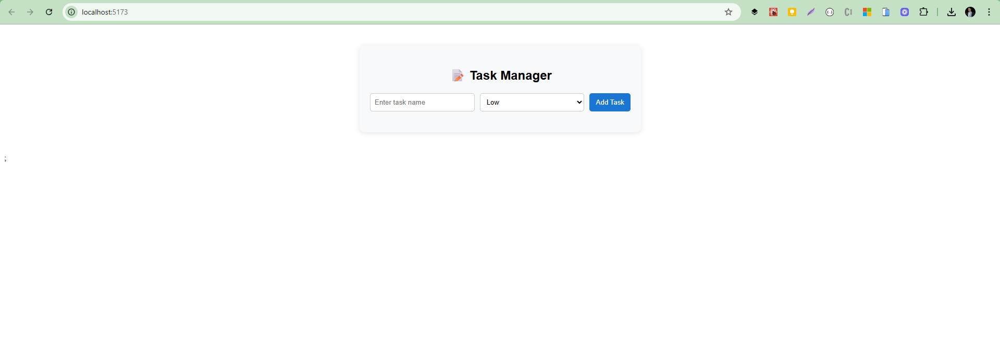
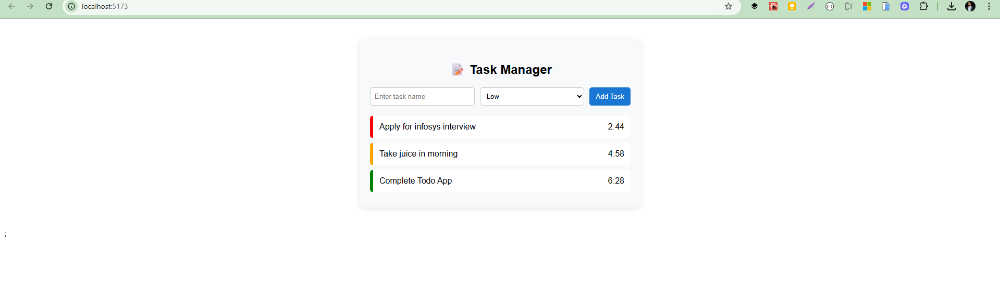

# ⚛️ React + TypeScript + Vite — Mini Task Manager ⏳

A sleek and minimal **Task Management System** built with **React**, **TypeScript**, and **Vite**.

---

## ✨ Features

📝 **Add Tasks** with a selected priority:
- 🔴 High – ⏱️ 3 minutes
- 🟠 Medium – ⏱️ 5 minutes
- 🟢 Low – ⏱️ 7 minutes _(default)_

📋 **Tasks auto-sort** by the time left ⏳

🚨 **When time runs out:**
- Task **blinks briefly**
- Then it is **auto-deleted**

💻 Built using:
- [React](https://reactjs.org/)
- [TypeScript](https://www.typescriptlang.org/)
- [Vite](https://vitejs.dev/)

---

## 📸 Screenshots

| Add Task Form | Task List with Countdown |
|---------------|--------------------------|
|  |  |


---

## 🚀 Getting Started

### 1️⃣ Clone the repo

```bash
git clone https://github.com/shandude786/mini-task-management
cd mini-task-management
